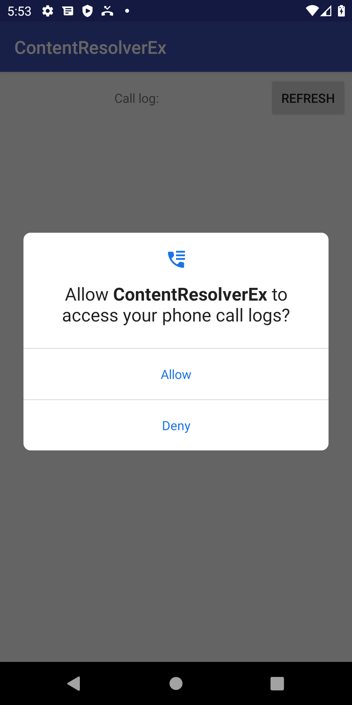

# 콘텐츠 리졸버(Content Resolver)
<!-- _class: lead -->
### 허준영(jyheo@hansung.ac.kr)


## 콘텐츠 제공자(ContentProvider)
* 콘텐츠 제공자는 구조화된 데이터 세트의 액세스를 관리, 다른 앱에서 데이터 접근 방법을 제공
* 콘텐츠 제공자 내의 데이터에 액세스하고자 하는 경우, 애플리케이션의 Context에 있는 ContentResolver 객체를 사용
    - ContentResolver는 데이터의 CRUD(Create,Read, Update, Delete) 제공
    - getContentResolver() 메소드로 ContentResolver 객체 획득
    - 콘텐츠 제공자를 나타내는 URI로 제공자 지정
* Android 자체에 오디오, 동영상, 이미지 및 개인 연락처 정보 등의 데이터를 관리하는 콘텐츠 제공자가 포함되어 있음
    - 참고: android.provider 패키지
* https://developer.android.com/guide/topics/providers/content-providers.html?hl=ko


## ContentResolver#query
* CallLog.Calls 콘텐츠 제공자에게 query()하기
    - getContentResolver(): ContentResolver 객체 가져오기
    - CallLog.Calls.CONTENT_URI: Call Log 콘텐츠 제공자의 URI
    ```java
    // 전화 기록(CallLog.Calls)를 질의하여 결과를 리턴
    Cursor cursor = getContentResolver().query(
        CallLog.Calls.CONTENT_URI,          // 콘텐츠 제공자의 URI
        new String[]{CallLog.Calls._ID, CallLog.Calls.NUMBER}, // 각 행에 포함될 열들
        null                                // 선택될 행들에 대한 조건
        null,                               // 조건에 필요한 인수
        null);                              // 선택된 행들의 정렬 방법
    // cursor adapter에 사용, calllog는 adapter view
    calllog.setAdapter(new SimpleCursorAdapter(this,
                android.R.layout.simple_list_item_1, cursor,
                new String[]{CallLog.Calls.NUMBER}, new int[]{android.R.id.text1}, 0));
    ```

<!--
query()할 때 CallLog.Calls._ID 는 cursor adapter에 사용할 때 꼭 필요함
-->


## ContentResolver insert/update/Delete
* SQL과 유사하게 query뿐 아니라 insert, update, delete를 지원
* ContentResolver의 아래 메소드를 사용
    - Uri insert (Uri url, ContentValues values);
    - int update(Uri uri, ContentValues values, String where, String[] selectionArgs);
    - int delete(Uri url, String where, String[] selectionArgs);


## 콘텐츠 제공자 접근 권한
* 보통 특정 콘텐츠 제공자에 접근하기 위해 권한을 필요로 함
* CallLog.Calls의 데이터를 읽기(query) 위해서는 READ_CALL_LOG 권한 필요
    - 데이터를 변경(insert, update, delete)하기 위해서는 WRITE_CALL_LOG 권한 필요


## 안드로이드 앱에 권한 부여/확인 하기 (1/4)
* 안드로이드 앱이 기기의 특정 데이터나 장치에 접근하기 위해 **권한** 을 필요로 함
* 권한 부여/확인하는 방법
    1. Manifest 파일에 **권한** 표시
    2. 데이터나 장치에 접근하기 전에 **권한** 을 확인
        - 해당 권한이 있으면 해당 데이터에 접근
        - 해당 권한이 없으면 사용자에게 요청 다이얼로그를 표시함
    3. 요청 다이얼로그 결과(Allow 또는 Deny)에 따라
        - Allow면 해당 데이터에 접근
        - Deny이면 해당 데이터에 접근하지 못하기 때문에 앱을 종료하거나 해당 데이터 접근 없이 진행

<!--
* Android 6.0 (API level 23) 이상부터는
    - 앱 실행 중에 필요한 권한(permission)을 반드시 확인하고 없으면 요청해야 함
    - 앱 사용자는 권한의 승인/거부를 결정
    - 앱의 환경설정에서 권한 설정을 언제든지 변경할 수 있음
-->


## 안드로이드 앱에 권한 부여/확인 하기 (2/4)
1. Manifest 파일에 권한 표시
    - 예를 들어 READ_CALL_LOG 라는 권한을 필요로 함
    ```xml
    <manifest xmlns:android="http://schemas.android.com/apk/res/android"
        package="com.example.jyheo.contentresolverex">
        <uses-permission android:name="android.permission.READ_CALL_LOG"/>
        <application ...>
        ...
        </application>
    </manifest>
    ```


## 안드로이드 앱에 권한 부여/확인 하기 (3/4)
2. 데이터나 장치에 접근하기 전에 **권한** 을 확인

```java
final int REQUEST_CODE_PERM_READ_CALL_LOG = 1;

private void updateCallLog() {
if (ActivityCompat.checkSelfPermission(this, Manifest.permission.READ_CALL_LOG)
                                    != PackageManager.PERMISSION_GRANTED) {
    ActivityCompat.requestPermissions(this,
                                new String[]{Manifest.permission.READ_CALL_LOG}, 
                                REQUEST_CODE_PERM_READ_CALL_LOG);
    return;
}

// Cursor cursor = getContentResolver().query( ... 
// calllog.setAdapter(new SimpleCursorAdapter(this,  ...

}
```




## 안드로이드 앱에 권한 부여/확인 하기 (4/4)

3. 요청 다이얼로그 결과(Allow 또는 Deny)에 따라

```java
@Override
    public void onRequestPermissionsResult(int requestCode, @NonNull String[] permissions, @NonNull int[] grantResults) {
        super.onRequestPermissionsResult(requestCode, permissions, grantResults);
        if (requestCode == REQUEST_CODE_PERM_READ_CALL_LOG) {
            if (grantResults.length > 0 && grantResults[0] == PackageManager.PERMISSION_GRANTED) {
                updateCallLog(); // 권한 필요한 기능 다시 수행
            } else {
                // permission for READ_CALL_LOG rejected!
                // 권한 요청의 필요성을 설명하는 다이얼로그, 다시 권한 요청 시도
                new AlertDialog.Builder(this).setTitle("Permission!")
                        .setMessage("READ_CALL_LOG permission is required to list the call log.\n" +
                                "Press OK to grant the permission.")
                        .setPositiveButton("OK", 
                                ((dialog, which) -> ActivityCompat.requestPermissions(this,
                                new String[]{Manifest.permission.READ_CALL_LOG}, REQUEST_CODE_PERM_READ_CALL_LOG)))
                        .setNegativeButton("Cancel", null)
                        .create().show();
            }
        }
    }
```

## 전체 소스 코드
*  https://github.com/jyheo/android-java-examples/tree/master/ContentResolverEx