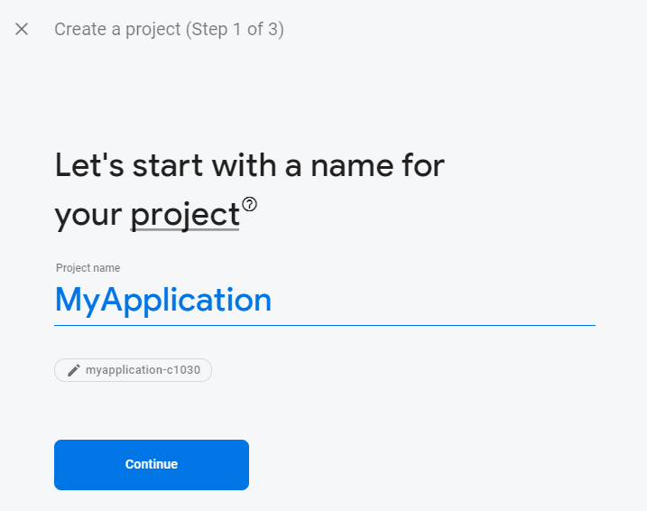

# Firebase
<!-- _class: lead -->
### Authentication
### 허준영(jyheo@hansung.ac.kr)


## 모바일 백앤드 서비스
- 모바일 앱이 기능의 일부나 데이터 저장을 원격 서버가 처리
    - 기계학습, 데이터베이스, 메시징 등
- 직접 서버를 설치하여 운영
    - 아파치 usergrid: http://usergrid.apache.org
- BaaS(Backend as a Service) 사용
    - Google의 백앤드 서비스 - Firebase
    - https://firebase.google.com


## Firebase 기능
- 앱 개발 -> 앱 개선 -> 비즈니스
- 앱 개발
    - Cloud Firestore, Realtime Database
    - Firebase ML -> ML Kit (https://developers.google.com/ml-kit)
    - Cloud Functions (Javascript/Typescript)
    - Authentication, Cloud Storage
- 앱 개선
    - Crashlytics, App Distribution, Performance Monitoring, Test Lab
- 비즈니스
    - Analytics, Cloud Messaging, In-App Messaging, Remote Config, Dynamic Links, App Indexing


## Firebase 시작하기
- Android Studio, Firebase Services plugin 최신 버전으로 업데이트
- 구글 계정 필요!
- 에뮬레이터 사용시 이미지는 Google Play 포함된 것으로!
- Tools > Firebase 메뉴 선택
    - 오른쪽 같은 Assistant가 생김
- Authentication 을 선택하고
    - Email and password authentication 선택
- 다른 기능도 동일하게 시작함
    - 최신 샘플 코드는 https://firebase.google.com/docs/guides 


## Firebase 시작하기
- Connect to Firebase 버튼, 권한 요청 페이지가 뜨면 '허용'
  


## Firebase 시작하기
- 새 프로젝트 이름 입력 하거나
- 기존 프로젝트에서 선택


## Firebase 시작하기
 

## Firebase 시작하기
 

## Firebase 시작하기
- Project 보기로 바꾼 후 app 폴더 밑에 보면
- google-services.json 이란 파일이 추가되었음  


## Firebase Authentication
- Add Firebase Authentication to your app 버튼
 


## Authentication
- 인증 객체 가져오기, 인증 상태 리스너
    ```java
    private FirebaseAuth mAuth;
    private ActivityLoginBinding binding;

    @Override
    protected void onCreate(Bundle savedInstanceState) {
        super.onCreate(savedInstanceState);
        binding = ActivityLoginBinding.inflate(getLayoutInflater());
        setContentView(binding.getRoot());

        mAuth = FirebaseAuth.getInstance();
    }
    ```
    - [github.com/jyheo/android-java-examples/.../FirebaseTest/.../LoginActivity.java](https://github.com/jyheo/android-java-examples/blob/master/FirebaseTest/app/src/main/java/com/example/jyheo/firebasetest/LoginActivity.java)


## Authentication
- 로그인 시작
    ```java
    public void onButtonLogin(View v) {
        String email = binding.etEmail.getText().toString();
        String password = binding.etPassword.getText().toString();
        mAuth.signInWithEmailAndPassword(email, password)
                .addOnCompleteListener(this, new OnCompleteListener<AuthResult>() {
                    @Override
                    public void onComplete(@NonNull Task<AuthResult> task) {
                        Log.d(TAG, "signInWithEmail:onComplete:" + task.isSuccessful());
                        if (task.isSuccessful()) {
                            Intent it = new Intent(LoginActivity.this, MainActivity.class);
                            startActivity(it);
                        } else {
                            Log.w(TAG, "signInWithEmail", task.getException());
                            Toast.makeText(LoginActivity.this, "Authentication failed.",
                                    Toast.LENGTH_SHORT).show();
                        }
                    }
                });
    }
    ```

## Authentication
- 로그 아웃
    ```java
    FirebaseAuth.getInstance().signOut();
    ```
    - [github.com/jyheo/android-java-examples/.../FirebaseTest/.../MainActivity.java#L143](https://github.com/jyheo/android-java-examples/blob/master/FirebaseTest/app/src/main/java/com/example/jyheo/firebasetest/MainActivity.java#L143)

## Authentication
- 테스트를 위해 콘솔에서 계정 생성 가능(https://console.firebase.google.com)


## Authentication
- 사용자 추가

    - FirebaseInstanceId.getInstance().getToken()의 리턴 값

## FirebaseUI
- FirebaseUI
    - https://firebase.google.com/docs/auth/android/firebaseui
- build.gradle
    ```
    dependencies {
        // ...
        implementation 'com.firebaseui:firebase-ui-auth:6.2.0'

        // Required only if Facebook login support is required
        // Find the latest Facebook SDK releases here: https://goo.gl/Ce5L94
        implementation 'com.facebook.android:facebook-android-sdk:4.x'

        // Required only if Twitter login support is required
        // Find the latest Twitter SDK releases here: https://goo.gl/E5wZvQ
        implementation 'com.twitter.sdk.android:twitter-core:3.x'
    }
    ```


## FirebaseUI

```java
List<AuthUI.IdpConfig> providers = Arrays.asList(
        new AuthUI.IdpConfig.EmailBuilder().build(),
        new AuthUI.IdpConfig.PhoneBuilder().build(),
        new AuthUI.IdpConfig.GoogleBuilder().build(),
        new AuthUI.IdpConfig.FacebookBuilder().build(),
        new AuthUI.IdpConfig.TwitterBuilder().build());

// Create and launch sign-in intent
startActivityForResult(
        AuthUI.getInstance()
                .createSignInIntentBuilder()
                .setAvailableProviders(providers)
                .build(),     RC_SIGN_IN);  // requestCode for onActivityResult
```

## FirebaseUI

```java
@Override
protected void onActivityResult(int requestCode, int resultCode, Intent data) {
    super.onActivityResult(requestCode, resultCode, data);
    if (requestCode == RC_SIGN_IN) {
        IdpResponse response = IdpResponse.fromResultIntent(data);
        if (resultCode == RESULT_OK) {
            // Successfully signed in
            FirebaseUser user = FirebaseAuth.getInstance().getCurrentUser();
        } else {
            if (response) {
                response.getError().getErrorCode()
            } else {
                // user canceled the sign-in flow using the back button
            }            
        }
    }
}
```