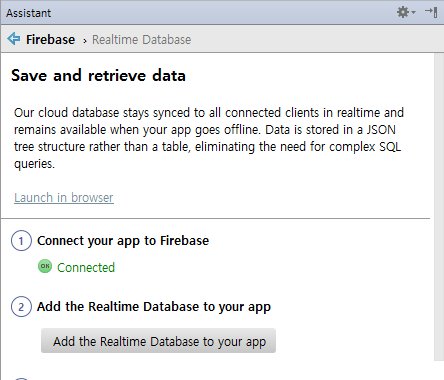
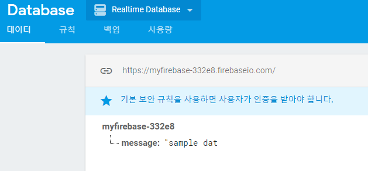
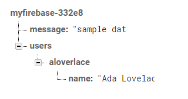

# Firebase
<!-- _class: lead -->
### Realtime Database
### 허준영(jyheo@hansung.ac.kr)


## Realtime Database
* 연결된 모든 클라이언트들이 클라우드 데이터베이스와 싱크를 할 수 있음
	* 읽기는 비동기식, 쓰기는 동기식으로 프로그래밍
* 오프라인이 되더라도 데이터베이스를 사용할 수 있음
* 데이터는 테이블이 아니라 JSON 트리 형태로 저장됨
* Firebase Assistant에서 Realtime Database
    - Save and retrieve data 선택  
    


## Realtime Database
* 한번 Firebase에 연결했다면, Connected로 나옴

* Add the Realtime Database to your app 버튼 클릭


## Realtime Database 
* Accept Changes


## 데이터 쓰기
* 데이터베이스 레퍼런스를 가져와서 setValue()를 호출하여 씀
	```java
	public void onWriteData(View v) {
        String db_value = binding.dbValue.getText().toString();
        FirebaseDatabase database = FirebaseDatabase.getInstance();
        DatabaseReference myRef = database.getReference("message");									

        myRef.setValue(db_value);
    }
	```
	
	* [github.com/jyheo/android-java-examples/.../FirebaseTest/.../MainActivity.java#L111](https://github.com/jyheo/android-java-examples/blob/master/FirebaseTest/app/src/main/java/com/example/jyheo/firebasetest/MainActivity.java#L111)


## 데이터 읽기
* ValueEventListener를 등록, 해당 값이 변경될 때마다 알려줌
* ValueEventListener를 등록하고 한번만 알려주길 원하면 addListenerForSingleValueEvent()를 사용
* ValueEventListener등록을 취소: removeEventListener()
	```java
	myRef.addValueEventListener(new ValueEventListener() {
		@Override
		public void onDataChange(DataSnapshot dataSnapshot) {
			String value = dataSnapshot.getValue(String.class);
			Log.d(TAG, "Value is: " + value);
		}

		@Override
		public void onCancelled(DatabaseError error) {
			Log.w(TAG, "Failed to read value.", error.toException());					
		}
	});
	```
	* [github.com/jyheo/android-java-examples/.../FirebaseTest/.../MainActivity.java#L119](https://github.com/jyheo/android-java-examples/blob/master/FirebaseTest/app/src/main/java/com/example/jyheo/firebasetest/MainActivity.java#L119)


## 데이터 구조
* JSON 트리
* child(): 자식 노드의 DatabaseReference를 가져옴
	```java
	FirebaseDatabase database = FirebaseDatabase.getInstance();
	DatabaseReference myRef = database.getReference("users");
	String userid = "aloverlace"
	String username = "Ada Lovelace"
	myRef.child(userid).child("name").setValue(username)
	```
	


## 데이터 구조
* push(), 고유한 아이디를 갖는 자식 노드를 생성함
* Map<String, Object> 형태의 값을 저장하는 예
	```java
	FirebaseDatabase database = FirebaseDatabase.getInstance();
	DatabaseReference myRef = database.getReference("posts");
	String key = myRef.push().getKey();
	HashMap<String, Object> postValues = new HashMap<>();
	postValues.put("uid", "aloverlace");
	postValues.put("author", "Ada Lovelace");
	postValues.put("title", "hello post");
	postValues.put("body", "hello body");
	postValues.put("starCount", 0);

	myRef.child(key).setValue(postValues);
	```


## 트랜잭션
* 트랜잭션 처리, runTransaction()
	```java
	FirebaseDatabase database = FirebaseDatabase.getInstance();
	DatabaseReference myRef = database.getReference("posts/-Kz4JAW5cxfcezCgBjRi");
	myRef.runTransaction(new Transaction.Handler() {
		@Override
		public Transaction.Result doTransaction(MutableData mutableData) {
	 		Long starCount = mutableData.child("starCount").getValue(Long.class);
			starCount++;
	 		mutableData.child("starCount").setValue(starCount);
			return Transaction.success(mutableData);
		}

		@Override
		public void onComplete(DatabaseError databaseError, boolean b, DataSnapshot dataSnapshot) {
			Log.d(TAG, "Transaction:onComplete:" + databaseError);
		}
	});
	```


## 데이터 정렬과 필터링
* 데이터 정렬: orderByChild(), orderByKey(), orderByValue()
	```java
	DatabaseReference databaseReference = FirebaseDatabase.getInstance().getReference();
	Query TopPostsQuery = databaseReference.child("posts").orderByChild("starCount");
	TopPostsQuery.addValueEventListener(new ValueEventListener() {
		@Override
		public void onDataChange(DataSnapshot dataSnapshot) {
	 		for (DataSnapshot postSnapshot: dataSnapshot.getChildren()) {
				// TODO: handle the post
			}
		}
		...
	}
	```
* 필터링: limitToFirst(), limitToLast()
	```java
	// Last 100 posts, these are automatically the 100 most recent
	Query recentPostsQuery = databaseReference.child("posts").limitToFirst(100);
	```

## 종합 예제
* https://github.com/firebase/quickstart-android/tree/master/database
