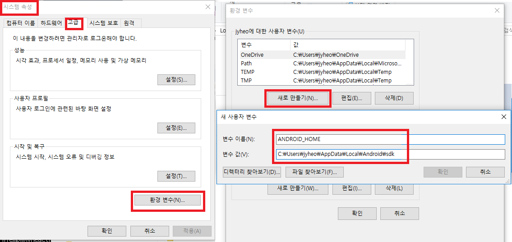
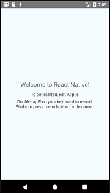

layout: true
.top-line[]

---
class: center, middle
# React Native

---
## React Native
* Build mobile Android and iOS apps using only JavaScript
* Rich mobile UI from declarative components
* Same fundamental UI building blocks as regular iOS and Android apps

 
---
## 환경 설치
* 윈도우즈 기준
* Node.js 설치
	- https://nodejs.org/en/download/
* Node.js command prompt 실행
* 커맨드 창에서 진행


.footnote[https://facebook.github.io/react-native/docs/getting-started.html]

---
## NPM downgrade
* React가 npm-5를 지원하지 못하므로 npm5일경우 npm-4로 다운그레이드

```bash
C:\Temp>npm -v
5.5.1

C:\Temp>npm install -g npm@4
C:\Users\jyheo\AppData\Roaming\npm\npm -> C:\Users\jyheo\AppData\Roaming\npm\node_modules\npm\bin\npm-cli.js
+ npm@4.6.1
added 299 packages in 11.373s

C:\Temp>npm -v
4.6.1
```

---
## ANDROID_HOME 변수 설정


---
## react-native 설치 및 프로젝트 생성

```bash
C:\Temp>npm install -g react-native-cli
	
C:\Temp>react-native init MyReactProject

C:\Temp>cd MyReactProject

* 에뮬레이터나 실제 기기를 연결해 둔 상태에서

C:\Temp\MyReactProject>react-native run-android
```

---
## 실행 결과




App.js 파일을 수정하고, 에뮬레이터에서 r키를 더블 클릭하면 수정된 앱이 다시 로드됨

---
## App.js

* ES2016(ES6) Javascript standard

```js
import React, { Component } from 'react';
import {Text} from 'react-native';

export default class App extends Component {
  render() {
    return (
		<Text>Hello, World!</Text>
    );
  }
}

```


---
## Props
* Component can be customized with 'Props'
	- Image: source, style
* View is a container for other components

```js
import React, { Component } from 'react';
import {Text, View, Image} from 'react-native';

export default class App extends Component {
  render() {
    return (
		<View>
			<Text>Hello, World!</Text>
			<Image 
*				source={{uri: 'http://www.hansung.ac.kr/html/themes/www/img/main/wrap6_slogan1.png'}}
*				style={{width: 205, height: 81}}				
			/>
		</View>
    );
  }
}
```


---
## Props - Custom Component
```js
import React, { Component } from 'react';
import {Text, View, Image} from 'react-native';

class Hello extends Component {
	render() {
		return (
*			<Text>Hello {this.props.name}!</Text>
		);
	}
}

export default class App extends Component {
  render() {
    return (
		<View>
*			<Hello name='World' />
*			<Hello name='Junyoung' />
		</View>
    );
  }
}
```


---
## Button
* Button
	- onPress
* Arrow function (Anonymous function)

```js
import React, { Component } from 'react';
import {Text, View, Button, Alert} from 'react-native';

export default class App extends Component {
	render() {
		return (
			<View>
*				<Button
					title="Button"
*					onPress={ () => { Alert.alert('Button Touch') } }				  
				/>
			</View>
		);
	}
}
```


---
## Button
* with named function

```js
import React, { Component } from 'react';
import {Text, View, Button, Alert} from 'react-native';

export default class App extends Component {
*	onPressButton() {
		Alert.alert('Button Touch')
	}
	
	render() {
		return (
			<View>
				<Button
					title="Button"
*					onPress={ this.onPressButton }				  
				/>
			</View>
		);
	}
}

```

---
## Style
```js
import React, { Component } from 'react';
import {Text, View, Button, StyleSheet} from 'react-native';

export default class App extends Component {
	render() {
		return (
			<View>
				<Text style={styles.red}>just red</Text>
				<Text style={styles.bigblue}>just bigblue</Text>
				<Text style={[styles.bigblue, styles.red]}>bigblue, then red</Text>
				<Text style={[styles.red, styles.bigblue]}>red, then bigblue</Text>
			</View>
		);
	}
}

*const styles = StyleSheet.create({
*	bigblue: {
		color: 'blue',
		fontWeight: 'bold',
		fontSize: 30,
	},
*   red: {
		color: 'red',
	}
});
```


---
## Text Input, State

```js
import React, { Component } from 'react';
import { Text, TextInput, Button, View, Alert } from 'react-native';

export default class App extends Component {
  constructor(props) {
    super(props);
*   this.state = {text: ''};
  }

  render() {
    return (
      <View style={{padding: 10}}>
*       <TextInput
          style={{height: 40}}
          placeholder="Type here!"
*         onChangeText={(text) => this.setState({text})}
        />
        <Text style={{padding: 10, fontSize: 42}}>
          {this.state.text}
        </Text>
        <Button
          title="Click"
          nPress={ () => { Alert.alert(this.state.text) } }
        />
      </View>
    );
  }
}
```


---
## Layout
* Flex Layout

```js
import React, { Component } from 'react';
import { View } from 'react-native';

export default class App extends Component {
  render() {
    return (
      <View style={{flex: 1}}>
        <View style={{flex: 1, backgroundColor: 'powderblue'}} />
        <View style={{flex: 2, backgroundColor: 'skyblue'}} />
        <View style={{flex: 3, backgroundColor: 'steelblue'}}>
		    <View style={{flex: 1, flexDirection: 'row'}}>
			  <View style={{flex: 1, backgroundColor: 'red'}} />
              <View style={{flex: 2, backgroundColor: 'green'}} />
              <View style={{flex: 3, backgroundColor: 'blue'}} />
			</View>
        </View>
      </View>
    );
  }
}
```


